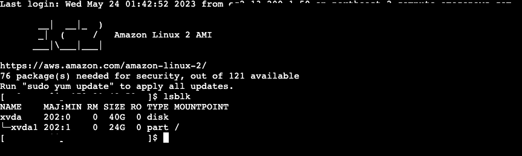
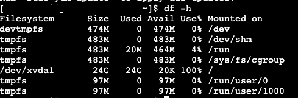

# EBS 볼륨 키우기

젠킨스 서버를 ec2 프리티어 서버에서 사용하던 중 용량을 많이 사용하게 되어서 EBS 볼륨을 키워야 되는 상황이 되었다. EBS란 Elastic Block Store이다. 컴퓨터 저장 공간인 SSD, HDD의 한 종류로 생각하면 된다.

EC2 인스턴스 → 스토리지에서 볼륨 업을 진행하였다면 사용할 수 있는 저장 공간이 늘어난다.
하지만 추가적인 작업이 남았다. 추가된 저장공간을 기존 저장 공간과 붙여줘야한다.

1. 우선 lsblk로 확장된 EBS Size와 사용되고있는 SIZE를 확인한다. 



## <더 알아보기> lsblk 명령어에 대한 설명 from Chat Gpt

lsblk는 Linux 시스템에서 사용되는 명령어로, 디스크와 파티션의 정보를 표시하는 데 사용됩니다. 특히 AWS(Amazon Web Services) 서버에서 사용될 때 EC2 인스턴스의 블록 장치 정보를 확인하는 데 유용합니다.

lsblk 명령어를 실행하면 블록 장치(디스크, 파티션, 볼륨 등)에 대한 테이블 형태의 출력이 표시됩니다. 출력에는 다음과 같은 정보가 포함될 수 있습니다:

1. NAME: 블록 장치의 이름을 표시합니다. 일반적으로 디스크는 "/dev/sdX" 형식으로 표시됩니다.
2. MAJ:MIN: 블록 장치의 주요 및 부가 번호를 표시합니다.
3. RM: 해당 장치가 제거 가능한지 여부를 나타냅니다. 0은 제거 불가능, 1은 제거 가능을 의미합니다.
4. SIZE: 블록 장치의 전체 크기를 표시합니다.
5. RO: 읽기 전용 여부를 나타냅니다. 0은 읽기/쓰기 가능, 1은 읽기 전용을 의미합니다.
6. TYPE: 블록 장치의 유형을 나타냅니다. 일반적으로 디스크는 "disk", 파티션은 "part"로 표시됩니다.
7. MOUNTPOINT: 블록 장치가 마운트된 디렉토리 경로를 표시합니다. 마운트되지 않은 경우 비어있을 수 있습니다.

이러한 정보를 통해 lsblk 명령어를 사용하여 AWS 서버의 블록 장치 구성을 확인하고 디스크 및 파티션 정보를 파악할 수 있습니다.

1. 파티션을 늘리기 전에 df -h 명령어로 “/” 아래에 마운트 된 루트 파티션이 가득 찼는지 확인합니다.

저같은 경우 /dev/xvda1 이 루트 파티션이고 100% 사용하고 있습니다.



1. lsblk -f 명령어를 통해 파일 시스템 유형이 XFS인 것을 확인합니다.


1. 블록 디바이스에 남는 공간 없음 오류를 막기위해 임시 파일 시스템 tmpfs를 /tmp 탑재 지점에 탑재합니다. 그러면 /tmp에 탑재된 10M tmpfs가 생성됩니다.

```jsx
$ sudo mount -o size=10M,rw,nodev,nosuid -t tmpfs tmpfs /tmp
```

1. growpart 명령을 실행하여 루트 파티션 또는 파티션 1의 크기를 늘립니다. /dev/xvda1을 루트 파티션으로 바꿉니다.

```jsx
$ sudo growpart /dev/xvda1 1
```

WARN: unknown label
failed [sfd_dump:1] sfdisk --unit=S --dump /dev/xvda1
sfdisk: /dev/xvda1: does not contain a recognized partition table
FAILED: failed to dump sfdisk info for /dev/xvda1

위와 같은 오류가 발생했습니다. 그래서 혹시나 해서 아래로 변경해주니 성공했습니다.

```jsx
$ sudo growpart /dev/xvda 1
```

growpart 에 전달하는 경로는 디스크 경로와 파티션 순서를 전달하는 건데 디스크 경로대신 파티션 경로를 주어 에러가 발생했던 거였습니다.

1. lsblk 명령어로 다시 파티션의 상태를 확인해보니 성공적으로 40기가로 사이즈업 된 것을 확인할 수 있습니다.


1. 아래 명령을 통해서 XFS 유형 파일 시스템이 확장됩니다.

```jsx
$ sudo xfs_growfs -d /
```


1. 마지막으로 df -h 를 사용하면 아래와 같이 확장된 것을 확인할 수 있었습니다.


참조

[https://repost.aws/ko/knowledge-center/ebs-volume-size-increase](https://repost.aws/ko/knowledge-center/ebs-volume-size-increase)