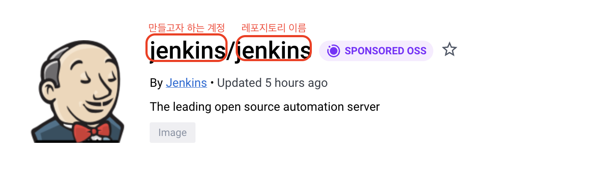

# Jenkins 초기 설정

- 지속적인 통합과 배포 → Work flow를 제어
    - Continuous Integration Server
        - Continuous Development, Build, Test, Deploy
- 다양한 Plugins 연동
    - Build Plugins: Maven, Gradle
    - VCS Plugins: Git, SVN
    - Lanaguages Plugins: Java, Python, Node.js

CI/CD tool 에는 Jenkins, circleci, TeamCity, Bamboo, GitLab이 있지만 여기서 오픈 소스로 운용 되는 것은 Jenkins 밖에 없으며 Build Agent License Pricing도 다른 서비스와 달리 무료로 제공된다.

Docker Deskop을 먼저 설치 후 진행해야 한다.



```kotlin
docker run -p 8080:8080 -p 50000:50000 --restart=on-failure --name jenkins-server jenkins/jenkins:lts-jdk11
```

`-p → publisher option`

컨테이너 내부의 포트를 외부 포트와 어떻게 연결할 지

컨테이너 외부에서 : 컨테이너 내부에서

`—restart=on-failure` 

실패했을 경우 재시작 옵션

jenkins/jenkins:lts-jdk11

만들고자하는 계정/레포지토리 이름: 사용하려는 태그 명

```kotlin
docker run -p 8080:8080 -p 50000:50000 --restart=on-failure -v jenkins_home:/var/jenkins_home --name jenkins-server jenkins/jenkins:lts-jdk11
```

`-v` 

볼륨 마운트 옵션

어떠한 운영체제와 mount 할 것인지

도커 내부에 저장된 데이터를 어딘가에 보관하기 위해서 사용한다.

`--name jenkins-server`

만들고자 하는 컨테이너에 이름을 부여

위와같이 이름을 지정하지 않으면 도커가 자동으로 이름을 생성한다.

```kotlin
docker run -d -v jenkins_thome:/var/jenkins_home -p 8080:8080 -p 50000:50000 --restart=on-failure jenkins/jenkins:lts-jdk11
```

`-d → detach 모드`

background 형식으로 진행

demon 형식으로 진행

위 명령어들로 실행 후 잘 진행되는 건지 확인하기 위해서 `docker ps` 명령어로 확인

STATUS 가 UP 상태인지 확인해야 한다.


도커 홈페이지에 접속하기 위해 localhost:8080으로 접속한다.

접속하게 되면 비밀번호를 입력해야한다.

-d 옵션으로 jenkins를 실행하였을 경우 비밀번호 확인을 하기위해 로그를 확인해야한다.

`로그 확인방법`

```kotlin
docker logs 컨테이너ID 혹은 컨테이너 네임
```


입력하게 되면 위와같이 나타난다.

빨간줄로 가린 부분에 젠킨스에 접속하기 위한 비밀번호가 있다.


접속하게 되면 위와같은 화면이 나타난다.

어떤 것을 선택해야 할지 모르겠다면 일단 모든 플러그인 설치모드를 선택한다.


설치를 진행하면 위와같이 2~3분의 시간이 소요된다.

젠킨스의 모든 설정이 끝이나면 관리자 계정으로 젠킨스에 접속할 수 있게 된다.

메인화면에 오게되면 첫 번째로 JDK를 설정한다.

설정하기 위해서 아래와 같이 Manage Jenkins → Global Tool Configuration으로 이동한다.


운영체제가 Linux나 mac os일 경우 환경 변수의 위치를 지정해줘야 한다.

jdk가 설정 되어있지 않을경우 Jenkins 자체가 구동이 안된다.

위 Global Tool Configuration에 들어가게 되면 JDK 설정 화면에 들어가게 된다.


자동으로 설치할 수 있는 JDK 버전의 경우 9까지밖에 지원하지 않기 때문에 11버전을 사용하기 위해서는 open jdk를 직접 설치해야 한다.

jdk설치된 버전을 확인하기 위해서 아래 명령어를 활용할 수 있다.

```kotlin
/usr/libexec/java_home -V
```


주의할 점은 위 명령어를 로컬 환경이아닌 jenkins에서 실행해야 된다.

```jsx
docker exec -it 컨테이너 네임 bash
```

위 명령어로 젠킨스 서버로 들어가서 명령어를 실행해야한다.