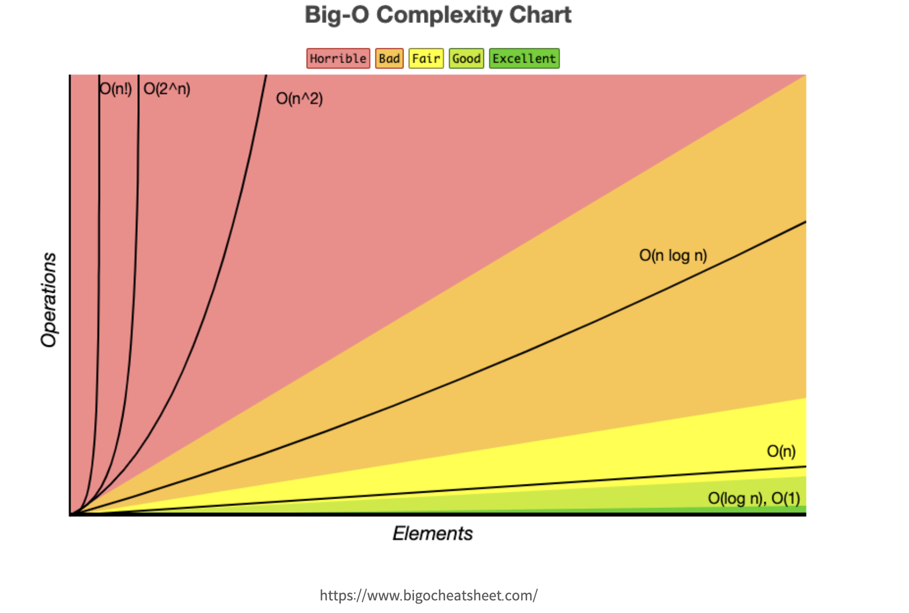

# 🚏INDEX

## Intro

책을 읽는 사람들은 보통 읽기전에 목차를 먼저 살펴본다. 목차를 살펴보면 책을 읽던 부분이 어떤 페이지인지 알 수 있고 책을 60퍼센트 정도 읽었다 가정하면 일단 책을 절반 부터 읽었던 부분을 찾을 것이다. 하지만 데이터베이스의 테이블은 첫 번째 데이터 부터 순서대로 모든 데이터를 찾는다. 이러한 비효율적인 방식을 개선한 방법이 있는데 바로 index이다.

### index란?

인덱스는 데이터베이스의 테이블에 대한 검색 속도를 향상시켜주는 자료구조이다. 인덱스의 구조는 인덱스가 정렬하고 있는 데이터가 실제로 저장된 원본 테이블의 해당 레코드에 대한 포인터를 유지하는 구조이다. 인덱스는 연락처 목록과 같이 사용자의 연락처 정보를 추가하는 순서대로 저장하는 것이 아닌 알파벳 순으로 나열하여 사용자를 더 빠르게 찾아낸다.

### index를 적용할 경우



인덱스를 적용하지 않고 탐색을 진행하게 되면 최악의 경우 모든 데이터를 탐색하게 되어서 O(n)만큼 탐색하게 된다. 인덱스를 적용하게 되면 데이터를 찾는 범위를 매번 절반씩 줄일 수 있기 때문에 시간 복잡도는 O(log n)만큼 걸리게 된다.

| 데이터(entry) 개수 | 인덱스를 적용한 경우의 탐색 횟수(최악의 경우) | 적용하지 않았을 때 탐색 횟수(최악의 경우 |
| --- | --- | --- |
| 8 | 3 | 8 |
| 100 | 7 | 100 |
| 1,000 | 10 | 1,000 |
| 10,000 | 14 | 10,000 |
| 100,000 | 17 | 100,000 |
| 1,000,000 | 20 | 1,000,000 |

### **인덱스의 종류**

- Clustered index
    - Clustered index는 기본 키를 사용하여 테이블 내의 데이터를 구성하는 테이블별 고유 인덱스이다. Clustered index는 기본 키가 증가된 순서로 저장되도록 한다. 이 순서는 테이블이 메모리에 유지하는 순서이기도 하다.
    - 테이블이 생성될 때 자동으로 생성되는 인덱스이다.
    - 자동으로 생성되기 때문에 명시적으로 생성할 필요가 없다.


- Non-Clustered index
    - Non-Clustered index는 기본 테이블의 특정 필드에 대한 정렬된 참조로 테이블의 원래 항목에 대한 포인터를 유지한다.
    - 비클러스터형 인덱스는 데이터 자체를 저장하는 대신 메모리 주소를 가리킨다. 따라서 Clustered index보다 쿼리 속도가 느리지만 일반적으로 인덱싱되지 않은 열보다 훨씬 빠르다.
    - 일반적으로 자동으로 생성된 인덱스가 아니라면 non-clustered 인덱스이다.
    
    
    

참조

[Indexing](https://dataschool.com/sql-optimization/how-indexing-works/)

### 인덱스의 단점

- 인덱스를 가진다는 것은 데이터를 특정한 기준으로 정렬된 값을 가지게 된다는 것이다. 그렇기 때문에 저장할 때 추가적인 작업이 발생해서 데이터를 자주 수정하게 될 경우 속도가 느려질 수 있다. 인덱스의 단점은 linked list의 단점과 비슷해 보인다.

### 인덱스 직접 만들어 보기 MySql 기준

- 인덱스 생성 명령어

```jsx
CREATE INDEX 인덱스 이름 ON 테이블 이름 ( 테이블의 컬럼 );
```

- 인덱스 제거 명령어

```jsx
ALTER TABLE 테이블 이름 DROP INDEX 인덱스 이름;
```

- 인덱스 확인 명령어

```jsx
SHOW INDEX FROM 테이블 이름
```

### 인덱스 적용 후 속도 비교해보기

인덱스를 적용 하였다면 속도를 비교해보고 싶을 것이다. Mysql의 경우 아래와 같이 특정 쿼리문에대한 속도를 확인해 볼 수 있다.

```jsx
EXPLAIN ANALYZE 쿼리문
```

### JPA 코틀린에서 index 적용 문법

```
@Entity
@Table(indexes = [Index(name = "인덱스 이름", columnList = "컬럼 이름")])
class Member(
```

위와같이 인덱스의 이름과 인덱스를 구성할 컬럼을 지정하여 JPA문법으로 인덱스를 쉽게 생성할 수 있다.
