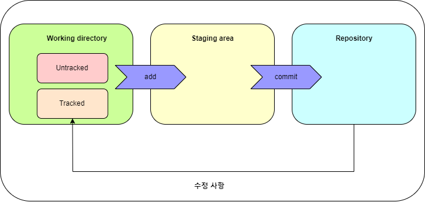

# 깃허브 기초 정리

### Git 최초 설정

git bash를 사용하면서 나의 정보 입력하는 방법

```jsx
git config --global user.name "(이름)"
git config --global user.email "(본인 이메일)"
```

확인하는 방법은 뒤에 추가한 이름과 이메일을 빼면 된다.

```jsx
git config --global user.name
git config --global user.email
```

기본 브랜치명 변경하는 방법

```jsx
git config --global init.defaultBranch main
```

기본 브랜치를 main으로 변경한다.

깃 관리 시작 해당 명령어로 .git 폴더가 생성되고 깃의 추적이 시작된다. 폴더는 숨김파일로 생성된다.

```jsx
git init
```

현재 로컬 저장소의 파일과 스테이징 저장공간 상태를 확인하려면 아래 명령어로 확인할 수 있다.

```jsx
git status
```

- untracked 추적하지 않는 파일 : Git의 관리에 들어간 적 없는 파일

### Git의 3가지 공간

깃허브에는 아래와 같이 3가지 저장 공간으로 이루어져 있다.

로컬의 변경 사항을 바로바로 레포지토리에 반영하지 않고 Staging area에 데이터를 add하여 Repository에 담게 된다. 구지 staging area를 두는 이유는 로컬 저장소의 변경 사항을 항상 모두 반영하는 것이 아닌 선택적으로 반영할 수 있도록 하기 위함이다.



### Add

Add 명령어로 Working directory에서 Staging area로 파일을 보낼 수 있다. Staging area로 보낸 파일들은 commit을 통해 repository에 반영될 수 있다.

Working directory의 모든 변경사항 담기 

```jsx
git add .
```

특정 파일 담기

```jsx
git add (파일 이름)
```

### Commit

아래 명령어로 local Repository에 반영할 수 있다. 

```jsx
git commit
```

해당 명령어가 실행되면 Staging area에 담겨있던 내용이 Repository로 commit 되어 반영된다.

위 명령어를 통해 commit을 하게 되면 commit 메시지를 입력할 수 있도록 vi에디터가 활성화 된다. 첫번 째 줄에 원하는 commit message를 입력하여 주면 된다.

커밋 메시지도 커밋 동시에 작성하고 싶다면 아래와 같은 명령어를 사용할 수 있다.

```jsx
git commit -m ‘First Commit’
```

지금 까지 커밋한 히스토리는 아래 명령어로 확인할 수 있다.

```jsx
git log
```

### Add와 Commit 한번에

개발을 하다 보면 그냥 모든 파일을 커밋하고 싶을 때가 있다. 그러한 상황에서는 add과 commit을 한번에 할 수 있는 명령어가 아래와 같이 존재한다.

```jsx
git commit -am '메시지'
```

여기서 주의할 점이 있다. 새로 추가한 파일은 untracked상태에 있다.  untracked 상태에 있다는 것은 개별적으로 add 명령어를 사용해야 된다는 의미이다. 해당 파일은 git add . 명령어나 별도로 스테이징 지역에 올려야 된다.
