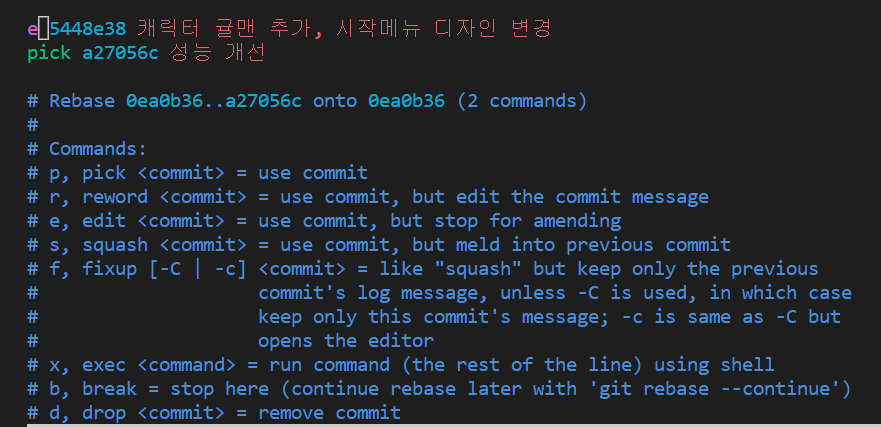

# 커밋 수정, 삭제, 병합, 분할

### 커밋 메세지 수정하려면

```jsx
git commit --amend
```

위와같이 수정하게되면 editor 창으로 이동하게 되어서 수정해야 된다.

하지만 아래와 같이 -m 명령어를 추가한 후 메시지를 붙이면 바로 수정할 수 있다.

```jsx
git commit -amend -M '수정된 메시지'
```

만약에 이미 커밋 해버린 사항에 추가적인 수정 사항을 반영하고 싶을 때 아래와 같은 명령어를 사용할 수 있다.

```jsx
git commit -a -amend -M 'Add members to Panthers and Pumas'
```

## **git rebase -i (대상 바로 이전 커밋)**

- 과거 커밋 내역을 다양한 방법으로 수정 가능
- revert를 사용하게 되면 수정한 것에 대한 커밋이 남지만 rebase를 사용하면 남지 않으니 주의해야 한다.

git rebase -i 명령어를 치고 pick 글씨가 나타나는데 해당 부분을 지우고 아래 단축 명령어(p,r,e,d,s)를 입력한다.

| 명령어 | 설명 |
| --- | --- |
| p, pick | 커밋 그대로 두기 |
| r, reword | 커밋 메시지 변경 |
| e, edit | 수정을 위해 정지 |
| d, drop | 커밋 삭제 |
| s, squash | 이전 커밋에 합치기 |

아래 이미지는 pick 부분을 e로 수정한 것을 나타낸다.



e 명령어를 선택했다면 아래 추가 명령어들도 같이 사용한다.

- git reset HEAD~
- 변화들을 다시 커밋
- git rebase —continue
